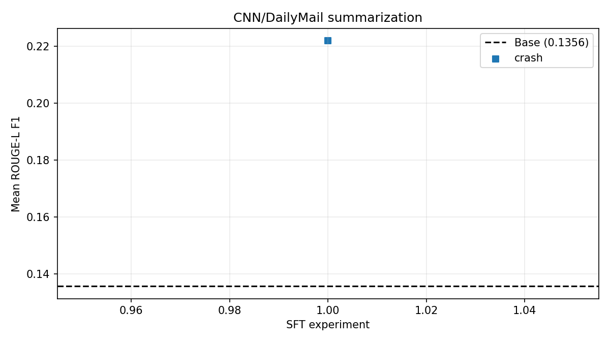

# Autoresearch results

| run_id | model_id | kind | epochs | lrm | batch size | rouge_l | delta_vs_base | eval_count | description |
| --- | --- | --- | --- | --- | --- | --- | --- | --- | --- |
| base-20261002T155033700805Z-a3d40d | gpt-4.1-nano | base | — | — | — | 0.1356 | 0.0000 | 100/100 | Base GPT-4.1-nano |
| **sft-20261004T030741731359Z-ea112e** | **gpt-4.1-nano-2025-04-14.ft-a92cf006bbdf46d89da010de04a8f610-auto-e47c6763** | **sft** | **2** | **1.0000** | **1** | **0.2220** | **0.0864** | **97/100** | **Invalid run metadata: resumed LRM 0.5000 job was labeled 1.0000 from current knobs; rerun with ledger-backed metadata** |
